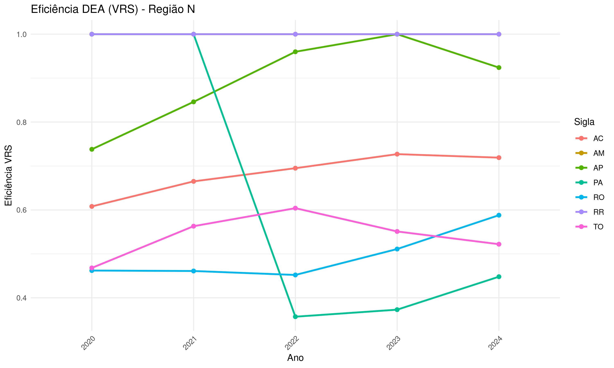
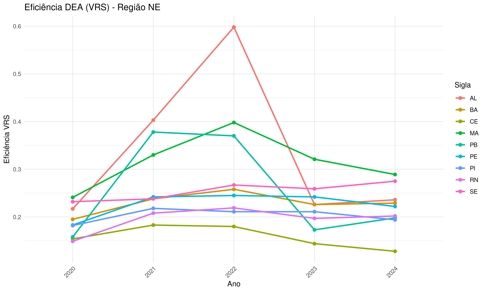
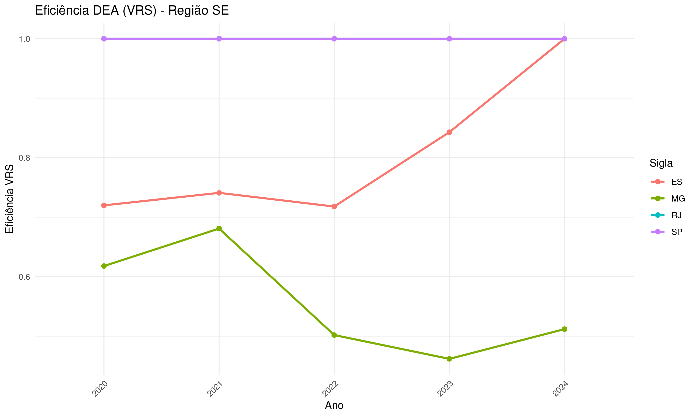
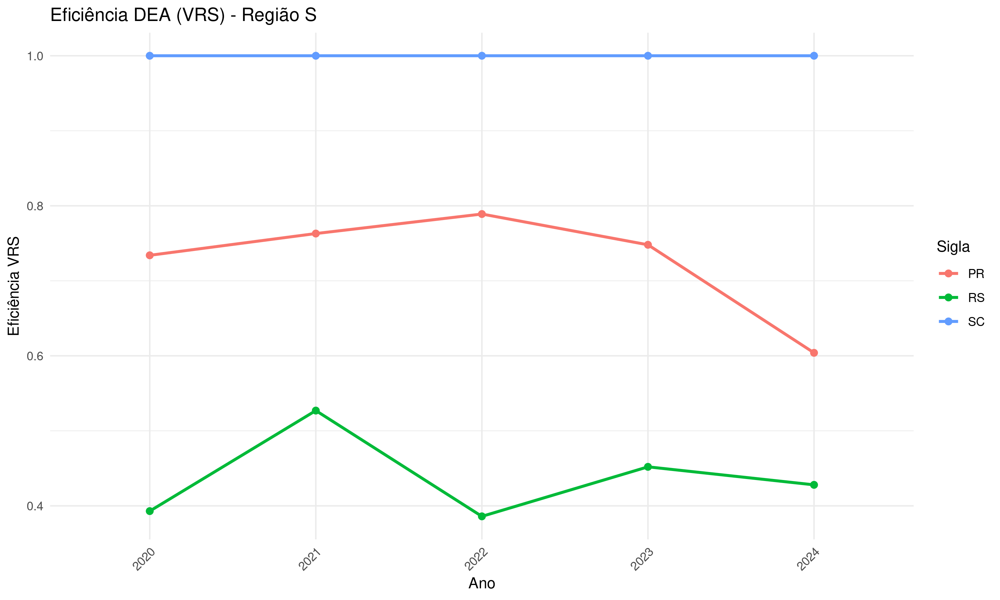

# 🧮 Estrutura do Modelo DEA para Eficiência Comercial

## 🎯 Objetivo

Avaliar quais Estados operam de forma eficiente em termos comerciais, considerando:

- **Input**: População acima de 25 anos (capital humano disponível)
- **Outputs**: Volume de exportações e importações

A proposta é identificar quais unidades federativas conseguem transformar seu recurso humano em desempenho comercial de forma mais eficaz.

---

## 📊 Variáveis do Modelo

| Tipo   | Variável                   | Descrição                                                  |
|--------|----------------------------|-------------------------------------------------------------|
| Input  | População acima de 25 anos | Representa o capital humano disponível                      |
| Output | Volume de Exportações      | Indicador de desempenho comercial externo                   |
| Output | Volume de Importações      | Proxy de integração global ou consumo interno               |

💡 **Observação**: Se o foco for eficiência produtiva/comercial, pode-se considerar:
- Exportações como output desejado
- Importações como input ou output indesejado, dependendo da interpretação analítica

---

## 🧠 Modelos DEA Possíveis

### Tipos de Retorno de Escala
- **CCR (Charnes, Cooper, Rhodes)**: Assume retornos constantes de escala
- **BCC (Banker, Charnes, Cooper)**: Assume retornos variáveis de escala

### Orientações do Modelo
- **Input-oriented**: Minimiza a população necessária para manter o mesmo nível de comércio
- **Output-oriented**: Maximiza o volume de comércio com a mesma população

---

## 📁 Arquivos do Projeto

| Arquivo                        | Descrição                                                  |
|-------------------------------|-------------------------------------------------------------|
| `exemplo_1.R`                 | Script principal para análise DEA                          |
| `exportacoes.xls`             | Dados de exportações por Estado e ano                      |
| `importacoes.xls`             | Dados de importações por Estado e ano                      |
| `populacao_25_mais.xls`       | População acima de 25 anos por Estado e ano                |
| `eficiencias_DEA_por_ano.xlsx`| Resultados de eficiência CRS, VRS e escala por ano         |
| `testes_hipotese_DEA.xlsx`    | Testes de hipótese para retorno de escala por ano          |
| `eficiencia_vrs_N.png`        | Gráfico de eficiência VRS por DMU – Região Norte           |
| `eficiencia_vrs_NE.png`       | Gráfico de eficiência VRS por DMU – Região Nordeste        |
| `eficiencia_vrs_SE.png`       | Gráfico de eficiência VRS por DMU – Região Sudeste         |
| `eficiencia_vrs_S.png`        | Gráfico de eficiência VRS por DMU – Região Sul             |

---

## 📈 Visualizações

### Região Norte

### Região Nordeste

### Região Sudeste

### Região Sul

---

## 📌 Considerações Finais

Este modelo pode ser aplicado para análises comparativas entre Estados, subsidiando políticas públicas voltadas à eficiência comercial e desenvolvimento regional.

---

